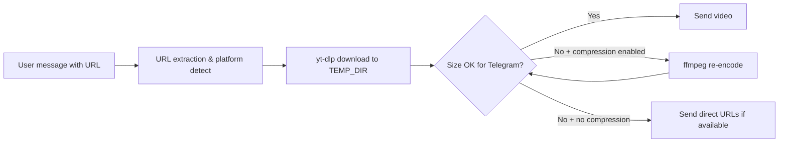

# LinkToClip

**LinkToClip** is a Telegram bot that downloads public videos from supported social platforms and sends them directly in chat. It uses [aiogram](https://docs.aiogram.dev/) for the Telegram layer and [yt-dlp](https://github.com/yt-dlp/yt-dlp) for extraction, with optional [ffmpeg](https://ffmpeg.org/) compression when files exceed Telegram’s upload limit.

---

## Table of contents

- [What it does](#what-it-does)
- [Supported platforms](#supported-platforms)
- [How it works](#how-it-works)
- [Tech stack](#tech-stack)
- [Requirements](#requirements)
- [Quick start (local)](#quick-start-local)
- [Configuration](#configuration)
- [Deployment](#deployment)
- [Health check (Render & similar)](#health-check-render--similar)
- [Operations & tuning](#operations--tuning)
- [Troubleshooting](#troubleshooting)
- [Repository layout](#repository-layout)
- [Limitations](#limitations)
- [Legal & disclaimer](#legal--disclaimer)
- [Contributing](#contributing)
- [License](#license)

---

## What it does

1. User sends a message containing a link (Instagram reel/post, TikTok, X/Twitter, or YouTube).
2. The bot detects the platform, downloads the best available video with **yt-dlp**, and replies with the video in Telegram.
3. If the file is **too large** for the Bot API (~50 MB), the bot can optionally **re-encode** with ffmpeg to shrink it, or fall back to **direct URLs** from metadata when possible.
4. On small cloud instances, the code **limits concurrent downloads** and avoids extra work by default to reduce memory spikes.

---

## Supported platforms

| Platform | Notes |
|----------|--------|
| **Instagram** | Reels, posts, and typical share URLs. Cloud/datacenter IPs often need a browser **`cookies.txt`** (`COOKIES_FILE`) even for public content. |
| **TikTok** | Standard `tiktok.com` / `vm.tiktok.com` style links. |
| **X (Twitter)** | `twitter.com` and `x.com` status URLs. Text-only posts or tweets without video will fail with a clear error. |
| **YouTube** | Regular watch URLs and short `youtu.be` links. |

Anything else is rejected with an “unsupported URL” style message.

---

## How it works



- **Long polling**: Telegram updates are received via `start_polling` (no webhook required).
- **Optional HTTP**: On hosts like Render, a tiny **health server** can listen on `PORT` so the platform sees the process as healthy; Telegram still uses polling, not that HTTP URL.

---

## Tech stack

| Piece | Role |
|-------|------|
| Python 3.11+ | Runtime |
| aiogram 3 | Telegram Bot API |
| yt-dlp | Video extraction / download |
| aiohttp | Health HTTP server (when `PORT` or `RENDER` is set) |
| ffmpeg / ffprobe | Optional compression (when `ENABLE_COMPRESSION=true`) |

---

## Requirements

- **Python** 3.11 or newer  
- **Telegram bot token** from [@BotFather](https://t.me/BotFather)  
- **ffmpeg** and **ffprobe** on `PATH` if you enable compression (`ENABLE_COMPRESSION=true`). The included **Dockerfile** installs ffmpeg for production-like runs.

---

## Quick start (local)

```bash
git clone https://github.com/m0hx65/LinkToClip.git
cd LinkToClip

python -m venv .venv
# Windows: .venv\Scripts\activate
# Linux/macOS: source .venv/bin/activate

pip install -r requirements.txt
```

Install ffmpeg on your OS if you plan to use compression (optional locally).

```bash
copy .env.example .env   # or: cp .env.example .env
# Edit .env: set BOT_TOKEN
python -m bot.main
```

For PaaS deployment, set `TEMP_DIR=/tmp` when the platform recommends it, and read [Configuration](#configuration) and [Operations & tuning](#operations--tuning).

---

## Configuration

Copy `.env.example` to `.env` and set variables as needed.

| Variable | Required | Default | Description |
|----------|----------|---------|-------------|
| `BOT_TOKEN` | **Yes** | — | Telegram bot token from BotFather. |
| `LOG_LEVEL` | No | `INFO` | Logging verbosity. |
| `TEMP_DIR` | No | `./data/temp` | Directory for temporary downloads. Use `/tmp` on many cloud hosts. |
| `TELEGRAM_MAX_FILE_BYTES` | No | ~49 MB | Max file size to upload via Bot API (stay under the ~50 MB limit). |
| `COMPRESS_TARGET_BYTES` | No | ~46 MB | Target size when compression runs. |
| `ENABLE_COMPRESSION` | No | `false` | Set `true` to allow ffmpeg shrinking for oversized files. Uses extra CPU/RAM—keep `false` on small instances. |
| `MAX_CONCURRENT_DOWNLOADS` | No | `1` | Cap parallel downloads; use `1` on low-memory hosts. |
| `COOKIES_FILE` | No | — | Path to Netscape `cookies.txt` from a logged-in **instagram.com** session; often needed on cloud IPs. |
| `PORT` | No | — | If set, the bot starts a minimal HTTP server on `0.0.0.0:$PORT` with `GET /` → `ok` (health check). |
| `RENDER` | No | — | If set (e.g. on Render), same as needing a listener—health server starts if `PORT` is unset (defaults to `10000` in code). |

---

## Deployment

### Docker

```bash
docker build -t linktoclip .
docker run --env-file .env linktoclip
```

The image is based on `python:3.12-slim` and installs **ffmpeg** for optional compression.

### Render

1. Connect this GitHub repository.  
2. Use the **Dockerfile** (recommended) or match the stack manually.  
3. **Start command:** `python -m bot.main`  
4. Set **`BOT_TOKEN`**. For a **Web Service**, set **`PORT`** (Render injects it) or rely on **`RENDER`** so the health server binds correctly.  
5. Optional: `TEMP_DIR=/tmp`, `MAX_CONCURRENT_DOWNLOADS=1`, `ENABLE_COMPRESSION=false`, and `COOKIES_FILE` for Instagram reliability.

A sample Blueprint is in [`render.yaml`](render.yaml) (worker-oriented; adjust service type to match your plan).

### Railway / other hosts

Same idea: provide `BOT_TOKEN`, use Docker if you need ffmpeg without manual buildpack setup, and set `TEMP_DIR` to the platform’s ephemeral disk path when documented.

---

## Health check (Render & similar)

When `PORT` or `RENDER` is set, the app serves **`GET /`** with body **`ok`** on `0.0.0.0` and the chosen port. That satisfies typical HTTP health checks. **Telegram does not call this URL**; the bot still uses **long polling**.

---

## Operations & tuning

- **Memory**: Video download + yt-dlp can spike RAM. Keep **`MAX_CONCURRENT_DOWNLOADS=1`** and **`ENABLE_COMPRESSION=false`** on free/small tiers unless you accept occasional OOM restarts.  
- **Instagram**: Datacenter IPs are often blocked or throttled; **`COOKIES_FILE`** is the most reliable fix for public reels.  
- **yt-dlp**: Sites change frequently; pin or periodically upgrade `yt-dlp` in `requirements.txt` if extractions start failing after platform updates.

---

## Troubleshooting

| Symptom | Likely cause | What to try |
|---------|----------------|-------------|
| Process exits with code **137** / “Killed” | Out-of-memory | Lower concurrency, disable compression, smaller instance or fewer parallel users. |
| Instagram always fails on the server | IP / session | Set **`COOKIES_FILE`**, ensure **`TEMP_DIR`** is writable. |
| “No video could be found” (X/Twitter) | Tweet has no video | Normal for text-only or photo-only posts. |
| Stuck on “Downloading…” | Long extract or crash | Check host logs; verify memory and `yt-dlp` version. |
| Video odd on iPhone, fine on Android | Codec / container | Instagram format selection prefers H.264 MP4; some edge cases may still need client-side playback testing. |

---

## Repository layout

```
LinkToClip/
├── bot/                 # aiogram app: main, handlers, health server, middleware
├── services/            # yt-dlp download + optional ffmpeg compression
├── platforms/           # URL detection + per-site yt-dlp options
├── utils/               # config, logging, messaging helpers
├── Dockerfile           # Production image with ffmpeg
├── requirements.txt
├── .env.example
└── README.md
```

---

## Limitations

- Telegram **Bot API** upload limit is about **50 MB** per file. This project does not implement a local Bot API server or MTProto for larger uploads.  
- Download success depends on **yt-dlp** and each platform’s availability; private or geo-restricted content may fail.  
- Respect copyright and each platform’s Terms of Service—only download content you are allowed to access.

---

## Legal & disclaimer

This tool is provided for legitimate personal or authorized use only. You are responsible for complying with applicable laws and with the terms of Telegram and each content platform. The authors are not liable for misuse.

---

## Contributing

See [CONTRIBUTING.md](CONTRIBUTING.md) for how to report issues and propose changes.

---

## License

Released under the [MIT License](LICENSE).
