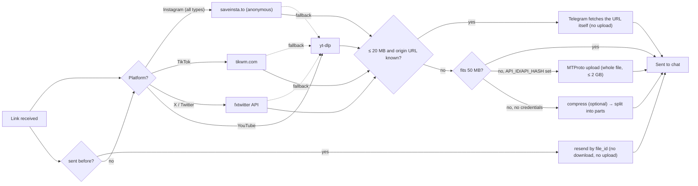

<div align="center">

# 🎬 LinkToClip

**Drop a link, get the video.**
A Telegram bot that downloads videos and photos from Instagram, TikTok, X (Twitter), and YouTube — straight into your chat.

[](https://github.com/m0hx65/LinkToClip/actions/workflows/ci.yml)
[](https://www.python.org/)
[](https://docs.aiogram.dev/)
[](https://github.com/astral-sh/ruff)
[](Dockerfile)
[](LICENSE)

</div>

---

## ✨ Features

- **Instagram** — reels, posts, photo carousels, **stories & highlights** — all served anonymously first (no login or cookies needed for public content, even from cloud IPs)
- **TikTok** — videos **and photo-mode posts**, from cloud/datacenter IPs without cookies
- **X / Twitter** — grabs **every attachment in a tweet**: photos, videos, GIFs, and mixed photo+video posts; fast path through the fxtwitter API
- **Multiple links per message** — paste up to 10 links in one message; each is downloaded and sent in order, and one bad link doesn't stop the rest
- **YouTube** — picks the highest-resolution H.264 stream so videos play everywhere, including iOS
- **Big files sent whole** — with Telegram API credentials set (`API_ID`/`API_HASH`), videos over the Bot API's ~50 MB cap are uploaded over **MTProto up to ~2 GB**, exactly as downloaded — no compression, no re-encoding, no splitting. Without credentials, the bot falls back to optional ffmpeg compression and automatic splitting into parts
- **Resilient by design** — every platform has a chain of independent download sources; if one service is down, the next takes over automatically
- **Built for small hosts** — bounded concurrency, streaming downloads, and stale-file cleanup keep memory and disk usage flat on free-tier instances

---

## 🧭 How it works

Each platform routes through its fastest source first and degrades gracefully to yt-dlp:


```mermaid
flowchart LR
    A[Link received] --> B{Platform?}
    B -- "Instagram (all types)" --> S["saveinsta.to (anonymous)"]
    B -- "TikTok" --> TK[tikwm.com]
    B -- "X / Twitter" --> FX[fxtwitter API]
    B -- "YouTube" --> Y[yt-dlp]
    S -. fallback .-> Y
    TK -. fallback .-> Y
    FX -. fallback .-> Y
    A --> C{"sent before?"}
    C -- "yes" --> FID["resend by file_id (no download, no upload)"] --> OK
    C -- "no" --> B
    S & TK & FX & Y --> U{"≤ 20 MB and origin URL known?"}
    U -- "yes" --> URL["Telegram fetches the URL itself (no upload)"] --> OK[Sent to chat]
    U -- "no" --> SZ{"fits 50 MB?"}
    SZ -- "yes" --> OK
    SZ -- "no, API_ID/API_HASH set" --> MT["MTProto upload (whole file, ≤ 2 GB)"] --> OK
    SZ -- "no, no credentials" --> CP["compress (optional) → split into parts"] --> OK
```

- **Long polling** — updates arrive via `getUpdates`; no webhook or public URL required.
- **Health endpoint** — on hosts like Render, a tiny HTTP server answers `GET /` → `ok` so the platform sees the process as healthy.
- **Repeat links** — an in-memory cache maps each link to the `file_id` Telegram assigned, so sending the same link again re-delivers it with no resolver call, no download and no upload, at any size. Keys ignore per-share tracking parameters (`?igsh=`, `?t=`), so the same reel shared by two people is one entry. The cache is cleared by a restart or an idle spin-down, and links delivered as split parts or MTProto uploads aren't cached (no Bot API `file_id` comes back from those).
- **Bandwidth** — when the media came from a public CDN (Instagram, TikTok, X) and fits the Bot API's URL-send cap of 20 MB (5 MB for photos), the bot passes Telegram the origin URL instead of re-uploading the bytes. Telegram fetches it directly, so the host serves no outbound traffic at all — which matters on metered plans like Render's. Anything larger, plus every yt-dlp result, is uploaded from disk as before; if Telegram declines the URL for any reason the already-downloaded file is uploaded instead, so this is invisible when it doesn't apply.
- **Performance** — one pooled HTTP session with DNS caching across all downloaders, HLS/DASH fragments fetched 4-wide, carousel/story items downloaded concurrently, and uploads run outside the download queue slot so the next request starts immediately.

---

## 🚀 Quick start

### Local

```bash
git clone https://github.com/m0hx65/LinkToClip.git
cd LinkToClip

python -m venv .venv
# Windows: .venv\Scripts\activate
# Linux/macOS: source .venv/bin/activate

pip install -r requirements.txt

cp .env.example .env      # Windows: copy .env.example .env
# edit .env → set BOT_TOKEN (get one from @BotFather)

python -m bot.main
```

ffmpeg is only needed if you enable compression or hit files large enough to split.

### Docker

```bash
docker build -t linktoclip .
docker run --env-file .env linktoclip
```

The image is based on `python:3.12-slim` and ships with ffmpeg included.

---

## ⚙️ Configuration

All configuration is via environment variables (or a local `.env` file — see [`.env.example`](.env.example)).

| Variable | Required | Default | Description |
|----------|:--------:|---------|-------------|
| `BOT_TOKEN` | ✅ | — | Telegram bot token from [@BotFather](https://t.me/BotFather). |
| `API_ID` / `API_HASH` | | — | Telegram API credentials from [my.telegram.org](https://my.telegram.org) → *API development tools*. When set, videos over ~50 MB upload whole via MTProto (up to ~2 GB) instead of being split. |
| `MTPROTO_MAX_FILE_BYTES` | | ~1990 MB | Ceiling for MTProto uploads, just under Telegram's 2000 MB bot limit. |
| `MTPROTO_SESSION_DIR` | | `./data` | Directory for the MTProto session file. Keep it outside `TEMP_DIR` so it isn't swept. |
| `LOG_LEVEL` | | `INFO` | Logging verbosity. |
| `TEMP_DIR` | | `./data/temp` | Scratch directory for downloads. Use `/tmp` on most cloud hosts. |
| `TELEGRAM_MAX_FILE_BYTES` | | ~49 MB | Upload ceiling; stays under the Bot API's ~50 MB limit. |
| `COMPRESS_TARGET_BYTES` | | ~46 MB | Target size when compression runs. |
| `ENABLE_COMPRESSION` | | `false` | Allow ffmpeg re-encoding of oversized videos. CPU/RAM heavy — keep `false` on small instances (splitting still works). |
| `MAX_CONCURRENT_DOWNLOADS` | | `1` | Parallel download slots. `1` is the safe choice on low-memory hosts; uploads don't count against it. |
| `COOKIES_FILE` | | — | Netscape `cookies.txt` used as the shared fallback for all platforms. Most useful for Instagram posts/reels on cloud IPs. |
| `TIKTOK_COOKIES_FILE` | | — | TikTok-specific cookies; overrides `COOKIES_FILE` for TikTok. Rarely needed thanks to the cookie-free chain. |
| `TWITTER_COOKIES_FILE` | | — | X/Twitter-specific cookies; needed for age-gated or restricted tweets. |
| `YOUTUBE_COOKIES_FILE` | | — | YouTube-specific cookies; helps when YouTube blocks datacenter IPs. |
| `PORT` | | — | If set, serves `GET /` → `ok` on `0.0.0.0:$PORT` for health checks. |
| `RENDER` | | — | Set automatically by Render; starts the health server (default port `10000`) even without `PORT`. |

---

## ☁️ Deployment

### Render

1. Connect this repository and choose the **Docker** runtime.
2. Set `BOT_TOKEN` in the environment (plus `API_ID`/`API_HASH` to send large videos whole).
3. For a **Web Service**, Render injects `PORT` and the health server binds automatically; for a **Background Worker**, use the included [`render.yaml`](render.yaml) Blueprint.
4. Recommended: `TEMP_DIR=/tmp`. Add `COOKIES_FILE` if Instagram posts/reels fail from Render's IPs.

> ⚠️ Run **one** process per `BOT_TOKEN`. A second poller (e.g. a local run alongside the deployed bot) causes `TelegramConflictError`.

> 💸 Render bills **outbound** bandwidth only (5 GB/month free on Hobby, then $0.15/GB) — downloading from Instagram or TikTok is free, sending to Telegram is not. Most clips avoid that charge entirely via the URL-send path described above; what still costs egress is anything over 20 MB, which is uploaded from the host. If a month runs hot, `MTPROTO_MAX_FILE_BYTES` caps the largest single upload.

### Railway / other hosts

Same recipe: provide `BOT_TOKEN`, prefer the Docker image (ffmpeg included), and point `TEMP_DIR` at the platform's ephemeral disk.

---

## 🔧 Operations & tuning

- **Memory** — downloads stream to disk in 1 MB chunks and yt-dlp fetches at most 4 fragments at a time. On free/small tiers keep `MAX_CONCURRENT_DOWNLOADS=1` and `ENABLE_COMPRESSION=false`.
- **Disk** — partial files from failed downloads are swept automatically after 2 hours; no cron needed.
- **Instagram** — all content types route through the anonymous saveinsta.to downloader first, so public posts/reels/stories work from datacenter IPs without cookies. `COOKIES_FILE` only matters for private-account content via the yt-dlp fallback.
- **yt-dlp** — platforms change constantly; if extractions start failing, upgrade `yt-dlp` first (`pip install -U yt-dlp`).

---

## 🩺 Troubleshooting

| Symptom | Likely cause | What to try |
|---------|--------------|-------------|
| Exit code **137** / "Killed" | Out of memory | Keep concurrency at 1, disable compression, or upsize the instance. |
| Instagram posts always fail on the server | saveinsta.to hiccup or private account | Public content needs no cookies — retry in a minute. Private accounts always need `COOKIES_FILE`; also verify `TEMP_DIR` is writable. |
| "No video could be found" (X) | Text-only tweet, or fxtwitter is down | Photo tweets normally work via fxtwitter; if it's down, only videos are recoverable through yt-dlp. |
| TikTok fails without cookies | Both sources blocked | Rare; set `TIKTOK_COOKIES_FILE` as a last resort. |
| `TelegramConflictError` on startup | Two pollers on one token | Stop the duplicate process (local run vs. deployed instance). |
| Video plays on Android but not iPhone | Codec | Format selection already prefers H.264 MP4 — report the URL as a bug. |

---

## 🗂️ Repository layout

```
LinkToClip/
├── bot/                  # aiogram app: entrypoint, handlers, health server, middleware
│   └── handlers/         # message handling & upload logic
├── services/             # download orchestration, fallback chains, ffmpeg compression/splitting
├── platforms/            # URL detection + per-site yt-dlp format selection
├── utils/                # config, logging, messaging helpers
├── .github/              # CI workflow, issue & PR templates
├── Dockerfile            # Production image (python:3.12-slim + ffmpeg)
├── render.yaml           # Render Blueprint (background worker)
├── pyproject.toml        # Tooling config (ruff)
└── requirements.txt      # Pinned runtime dependencies
```

---

## 🛠️ Development

```bash
pip install -r requirements.txt ruff
ruff check .          # lint (CI enforces this)
python -m bot.main    # run locally
```

CI runs on every push and PR: ruff lint, import checks on Python 3.11 & 3.12, and a Docker build. See [CONTRIBUTING.md](CONTRIBUTING.md) for guidelines.

---

## 📏 Limitations

- Telegram caps bot uploads at **~2 GB** (MTProto, with `API_ID`/`API_HASH` set). Beyond that — or when credentials aren't configured, where the ~50 MB Bot API limit applies — videos are split into parts (or compressed when enabled).
- Success ultimately depends on what each platform serves: private, geo-restricted, or deleted content will fail with a clear message.

## ⚖️ Legal

For legitimate personal or authorized use only. You are responsible for complying with applicable laws and the terms of Telegram and each content platform. Only download content you have the right to access. The authors accept no liability for misuse.

## 📄 License

Released under the [MIT License](LICENSE).
